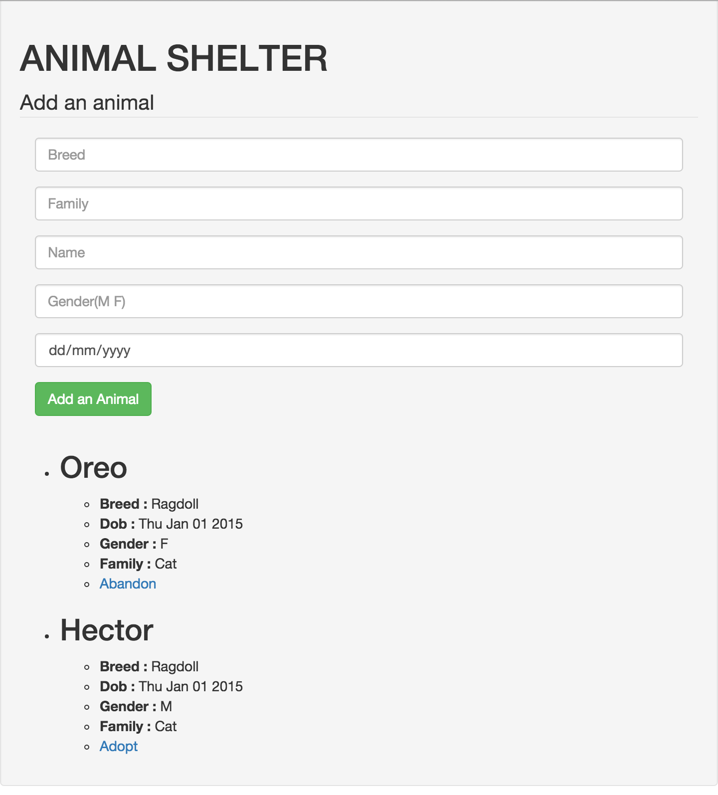

# Mongoose Creation, Updates, & Queries Lab

## Introduction

> ***Note:*** _This can be a pair programming activity or done independently._

We've seen how to use MongoDB in a Node environment, so now, let's practice Mongo, Node and Mongoose in this lab. Imagine you work for a pet shelter, and you've been asked to create an MVP for a user interface that will allow you to keep track of adoptions, abandonments, and drop-offs.  You'll have to build a small web application that will allow a user to manipulate records through links and a form.

## Exercise

#### Requirements

1. The Application should have 4 funtions:
  - See all pets (index | render a html listing all pets)
  - Leave a new pet in the shelter (create | create a pet & redirect to index)
  - Adopt a pet (update | update a pet & redirect to index)
  - Abandon a pet (update | update a pet & redirect to index)

1. The root page and `/animals` will show the list of animals

1. The index page should:
  1. Show a form to create a new animal
  1. For each animal, a link will be displayed
    - If the animal is "orphan", then the link will be to "adopt" the animal
    - If the animal is "adopted", then the link will be to "abandon" the animal

1. Create a model Animal with these fields:
  - name(String)
  - breed(String)
  - dob(Date)
  - gender(String)
  - family(String)
  - status(String)

**Bonus:**

- Add some style (Bootstrap)
- Add a field image to link pictures from the web
- Add validations with Mongoose

#### Starter code

This repo is a Node js app containing all the packages you need; run `npm install` to set the packages and create a mongo database named `animalshelter`.

Then, run the app!

#### Deliverable

## Additional Resources

- [Express JS documentation](http://expressjs.com/api.html)
- [MongooseJS documentation](http://mongoosejs.com/docs/api.html)
